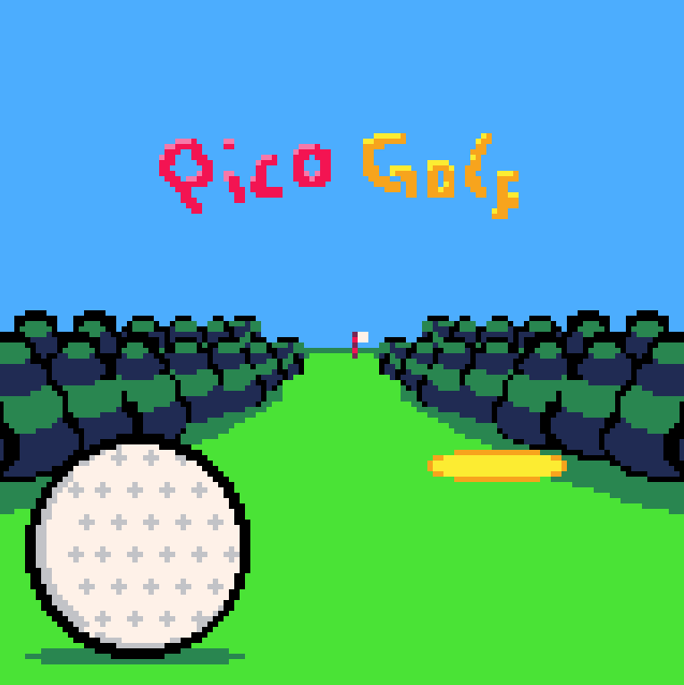
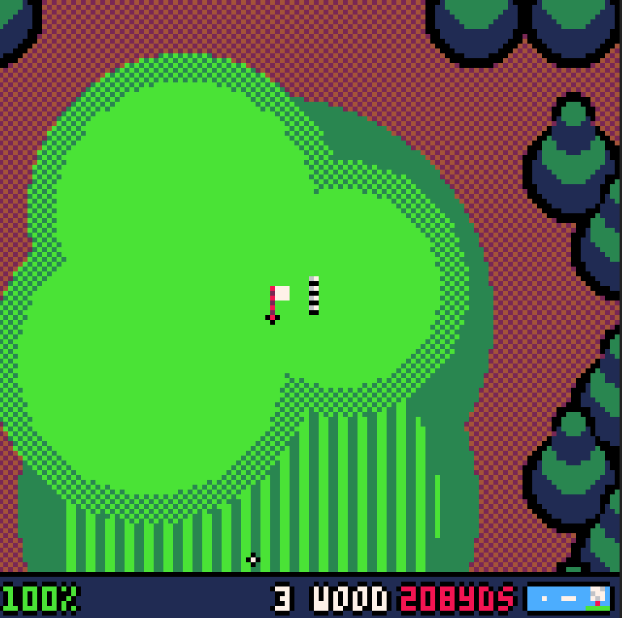

# pico8-golf

picogolf, made with [PICO-8](https://www.lexaloffle.com/pico-8.php) contains a single 9 hole course featuring a range of par 3, 4 and 5 holes. There are no settings, nothing gets saved, if you wanna play again, just reload the page.

## Notes from author

The code is a right mess! PICO-8 has a limit on the number of tokens you can use (tokens being words of code I guess!) and I was pushing right up against the limit. This meant I had to do a lot of code golfing to get everything I wanted to fit in... ish.

## Screenshots

| | |
:-------------------------:|:-------------------------:
  |  

## Live version

picogolf can be played on [itch.io](https://chrismingay.itch.io/picogolf)

## Controls
Everything is controlled using the arrow keys and the Z and X keys.

### while aiming...

left and right to aim
hold up to zoom out
press down to cycle through clubs
press X to cycle view modes between close up aim, distant aim, whole course and pin
press Z to start your shot

### while preparing a shot...

press X to cancel if you haven't already started a shot
press Z to start your swing
press Z to indicate the power of your shot
press Z again to to set your shot accuracy, aim to be as close to the green marker as possible

### while driving...

left and right to steer
hold Z or up to accelarate
hold down to brake
park up near the ball to take another shot
## Tips

Always look out for the wind indicator, this will affect any shots hit into the air.

The number range to the bottom left of the screen indicates how well you might hit the ball. For example using a driver while in the bunker shows 20-100%. This means you could hit anything between 20% and 100% of your indicated power, so don't rely on it! Cycle through your clubs to see what your best option is.

The game will try to automatically select a suitable club, but it might not be the best one for you so give them all a go.

Hitting a ball into water or too fair away from the course will add a penalty stroke and reset your ball.
What next?

I would love to add more courses but I've just about hit the limit of what I can code (Pico-8 limits the amount of code 'tokens' you're allowed to use). I would also like to add both local and online multiplayer. I've got a few other ideas, but I might have to save that for a different game engine.

## Credits
- lexaloffle for making pico-8
- kometbomb for their fade to black implementation
- freds72 for their rspr implementation
- Though made by me, the music is a crude remake of a couple of tracks from one of my favourite ever games, Everybody's Golf on the PS Vita.

## Change log
### 1.1.0
- Prevent taking a shot after putting
- Stat tracking!
### 1.0.2
- Fix crash when taking too many shots
### 1.0.1
- Buggy now produces exhaust when using Z to accel.
### 1.0
- Initial and only release, definitely no bugs.
